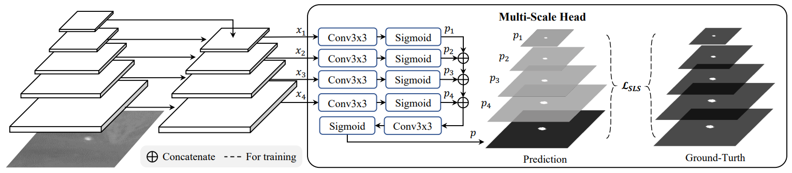

# Infrared Small Target Detection with Scale and Location Sensitivity

## Notice! 📰
First of all, thank you to all relevant workers for your attention. Recently, many people have discovered some obvious errors in the code, so we re-checked, modified and debugged the code. Surprisingly, we unexpectedly obtained a pretty good result on the IRSTD-1k data set. The results are published below for your reference.
| Dataset         | mIoU (x10(-2)) | Pd (x10(-2))|  Fa (x10(-6)) | Weights|
| ------------- |:-------------:|:-----:|:-----:|:-----:|
| IRSTD-1k | 67.87 | 92.86 | 8.88 | [new_weights](https://drive.google.com/file/d/1CSDwQG8xg7hv0_oGKa4NCEWUiMRU7eIs/view?usp=sharing) |

## Overview


## Introduction
This repository is the official implementation of our CVPR 2024 paper [Infrared Small Target Detection with Scale and Location Sensitivity](https://arxiv.org/abs/2403.19366).

In this paper, we first propose a novel Scale and Location Sensitive (SLS) loss to handle the limitations of existing losses: 1) for scale sensitivity, we compute a weight for the IoU loss based on target scales to help the detector distinguish targets with different scales: 2) for location sensitivity, we introduce a penalty term based on the center points of targets to help the detector localize targets more precisely. Then, we design a simple Multi-Scale Head to the plain U-Net (MSHNet). By applying SLS loss to each scale of the predictions, our MSHNet outperforms existing state-of-the-art methods by a large margin. In addition, the detection performance of existing detectors can be further improved when trained with our SLS loss, demonstrating the effectiveness and generalization of our SLS loss. The contribution of this paper are as follows:

1. We propose a novel scale and location sensitive loss for infrared small target detection, which helps detectors distinguish objects with different scales and locations.
   
2. We propose a simple but effective detector which achieves SOTA performance without bells and whistles.
   
3. We apply our loss to existing detectors and show that the detection performance can be further boosted.

## Training
The training command is very simple like this:
```
python main --dataset-dir --batch-size --epochs --lr --mode 'train'
```

For example:
```
python main.py --dataset-dir '/dataset/IRSTD-1k' --batch-size 4 --epochs 400 --lr 0.05 --mode 'train'
```

## Testing
You can test the model with the following command:
```
python main.py --dataset-dir '/dataset/IRSTD-1k' --batch-size 4 --mode 'test' --weight-path '/weight/MSHNet_weight.tar'
```

## Visual Results


## Quantative Results
| Dataset         | mIoU (x10(-2)) | Pd (x10(-2))|  Fa (x10(-6)) | Weights|
| ------------- |:-------------:|:-----:|:-----:|:-----:|
| IRSTD-1k | 67.16 | 93.88 | 15.03 | [IRSTD-1k_weights](https://drive.google.com/file/d/1q3zfzJRczodGQb0dZ3y3KmLn0zz4F8ra/view?usp=drive_link) |
| NUDT-SIRST | 80.55 | 97.99 | 11.77 | [NUDT-SIRST_weights](https://drive.google.com/file/d/1uczanUIHePZqJA79RZu25fv9FNSHSDQZ/view?usp=drive_link) |


## Citation
**Please kindly cite the papers if this code is useful and helpful for your research.**

    @inproceedings{liu2024infrared,
      title={Infrared Small Target Detection with Scale and Location Sensitivity},
      author={Liu, Qiankun and Liu, Rui and Zheng, Bolun and Wang, Hongkui and Fu, Ying},
      booktitle={Proceedings of the IEEE/CVF Computer Vision and Pattern Recognition},
      year={2024}
    }
